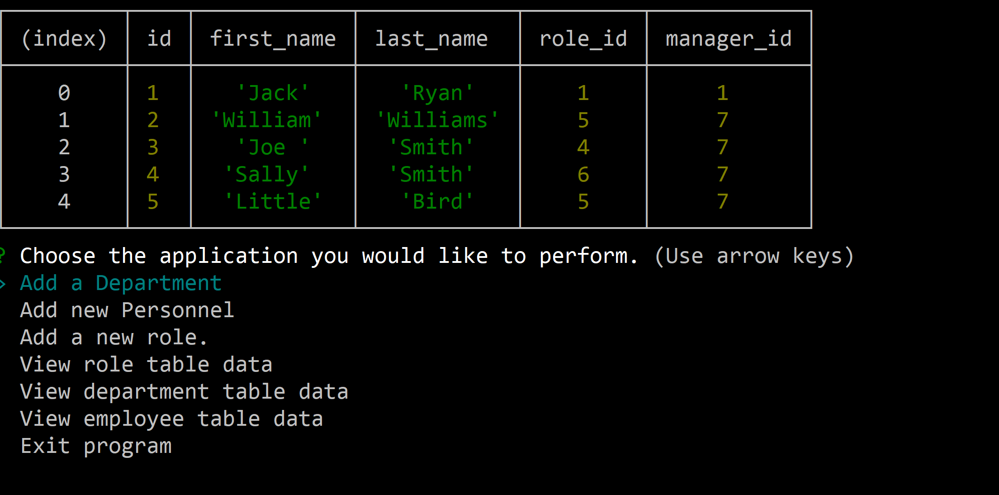

# Employee-Tracker

This project is simple command line application dimonstration the ability to view and manipulate
data in SQL database using node.js and Inguirer. With this application I am able to:

- Add personnel to employee table.
- Add department roles to the role table.
- Add departments in the department table
- View data from the employee table
- View data from the role table
- View data from the department table

[Video] (https://drive.google.com/file/d/1F5n7D3NrjX7OO--6z_fKamUegPV-SxUS/view?usp=sharing)

